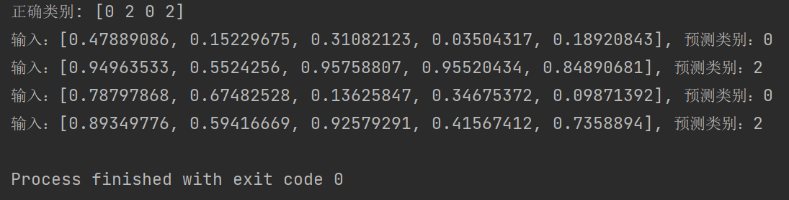

## Requirement:
Modify the training target in TorchDemo to multi classification and rewrite the training code.

## Solution:
:dog:
* **1. change loss:**   
`self.loss = nn.CrossEntropyLoss()`  

* **2. new y:**  
`y = np.argmax(arr)`  

* **3. result:**

  **Image:**
  

  **Text version:**  

  正确类别: [0 2 0 2]

  输入：[0.47889086, 0.15229675, 0.31082123, 0.03504317, 0.18920843], 预测类别：0  
  输入：[0.94963533, 0.5524256, 0.95758807, 0.95520434, 0.84890681], 预测类别：2  
  输入：[0.78797868, 0.67482528, 0.13625847, 0.34675372, 0.09871392], 预测类别：0   
  输入：[0.89349776, 0.59416669, 0.92579291, 0.41567412, 0.7358894], 预测类别：2

